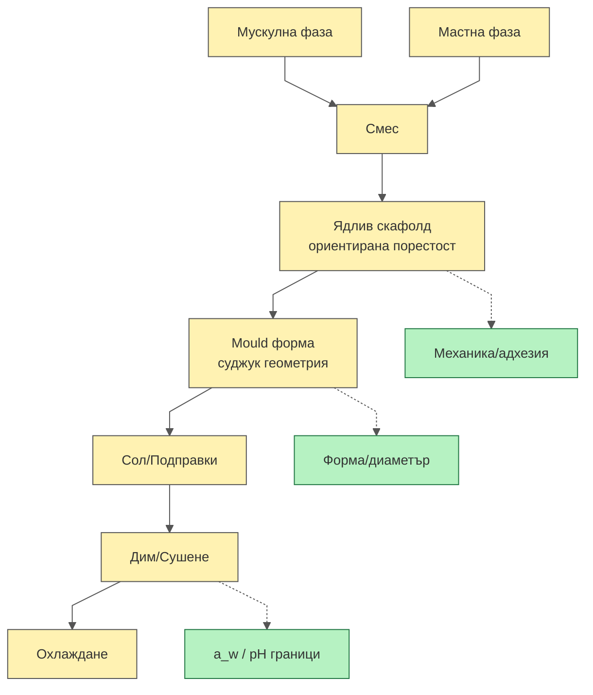
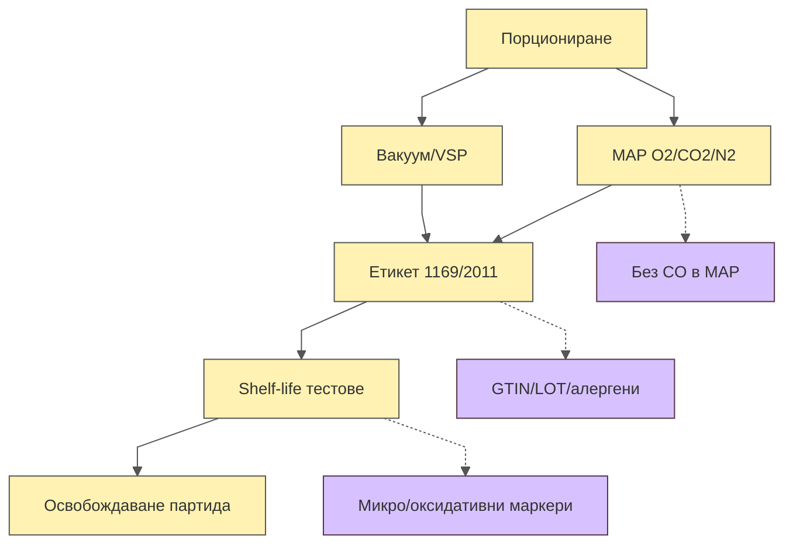
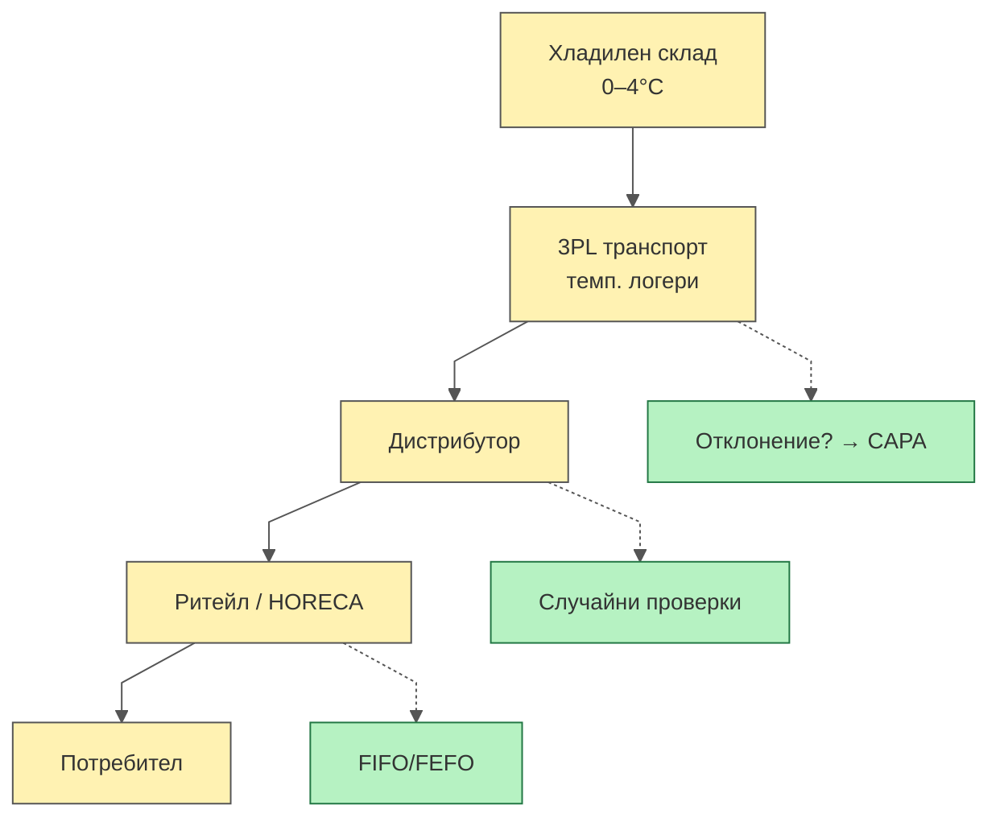
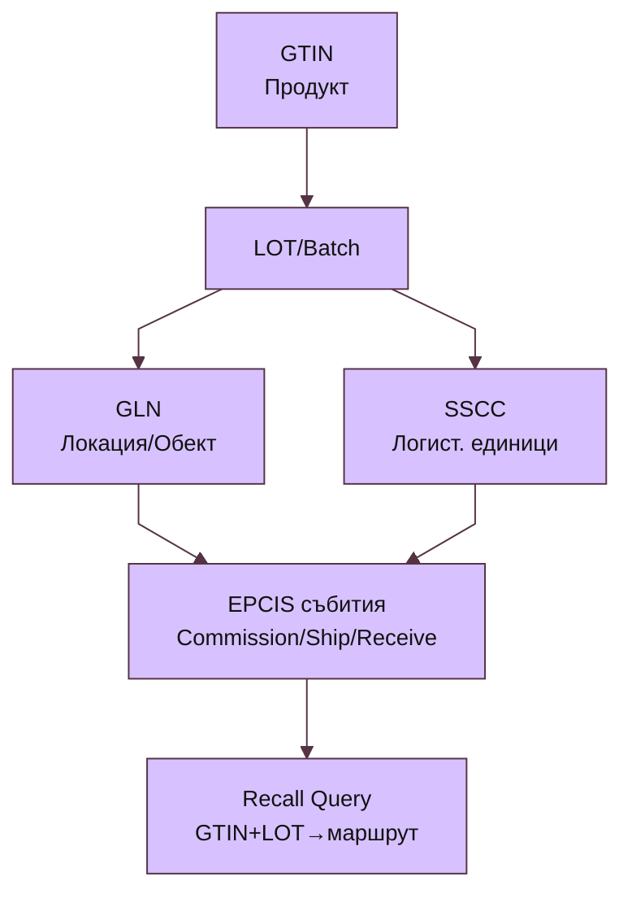
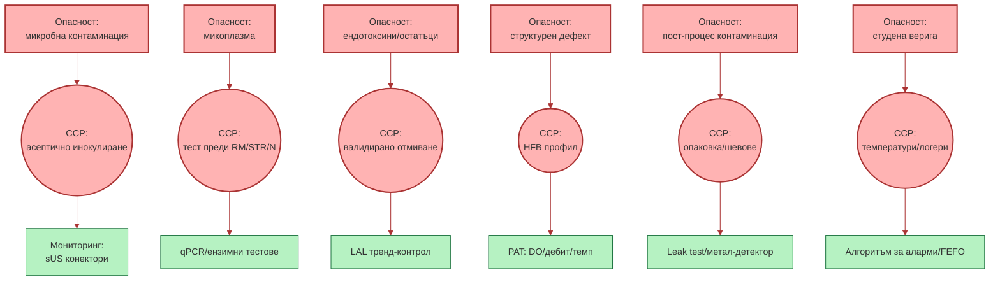
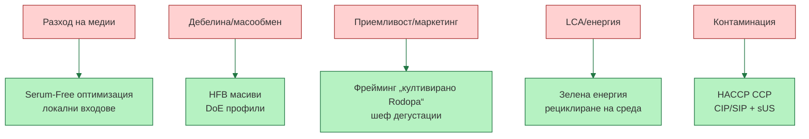

# Легенда
🟨 Процес/Етап · 🟦 Контроли/PAT · 🟩 Качество/QC · 🟥 CCP/Риск · 🟪 Данни/Проследимост · 🟫 Опаковка/Студена верига

---

## Диаграма 1 — End-to-End (E2E) поток
```mermaid
%%{init: {'theme':'base','flowchart':{'htmlLabels':true,'curve':'linear'},'themeVariables':{'primaryColor':'#fff2b2','lineColor':'#555','textColor':'#222','fontSize':'14px'}} }%%
flowchart TB
  A[MCB/WCB<br/>Клетъчни банки] --> B[Seed Train<br/>Thaw→RM→STR]
  B --> C[Перфузия HFB<br/>масив кухи влакна]
  C --> D[Harvest<br/>тъкан]
  D --> E[Assembly<br/>ядлив скафолд + mould]
  E --> F[Сол/Подправки/Дим<br/>профил Rodopa]
  F --> G[Охлаждане/Стабилизация]
  G --> H[QC Release<br/>микро/ендотоксини/сензорика]
  H --> I[Опаковка<br/>Vacuum/VSP или MAP]
  I --> J[Студена верига<br/>0–4°C]
  J --> K[Дистрибуция/3PL<br/>GS1 EPCIS събития]
  K --> L[Ритейл/HORECA]

  B -.-> Bc[(PAT:<br/>pH/DO/Glc/Lac)]
  C -.-> Cc[(PAT:<br/>Debit/DO/Temp)]
  H -.-> Hd[(QA/QC:<br/>панели/граници)]
  I -.-> Id[(Етикет/1169/2011)]
  K -.-> Kd[(EPCIS 2.0:<br/>GTIN/LOT/GLN/SSCC)]

  classDef proc fill:#fff2b2,stroke:#555,color:#222;
  classDef pat fill:#b2d7ff,stroke:#355,color:#122;
  classDef qc fill:#b6f2c2,stroke:#274,color:#143;
  classDef data fill:#d7c2ff,stroke:#534,color:#312;
  class A,B,C,D,E,F,G,H,I,J,K,L proc;
  class Bc,Cc pat; class Hd qc; class Id,Kd data;
````

```mermaid
%%{init: {'theme':'base','flowchart':{'htmlLabels':true,'curve':'linear'},'themeVariables':{'primaryColor':'#fff2b2','lineColor':'#555','textColor':'#222','fontSize':'14px'}} }%%
flowchart TB
  A[MCB/WCB<br/>Клетъчни банки] --> B[Seed Train<br/>Thaw→RM→STR]
  B --> C[Перфузия HFB<br/>масив кухи влакна]
  C --> D[Harvest<br/>тъкан]
  D --> E[Assembly<br/>ядлив скафолд + mould]
  E --> F[Сол/Подправки/Дим<br/>профил Rodopa]
  F --> G[Охлаждане/Стабилизация]
  G --> H[QC Release<br/>микро/ендотоксини/сензорика]
  H --> I[Опаковка<br/>Vacuum/VSP или MAP]
  I --> J[Студена верига<br/>0–4°C]
  J --> K[Дистрибуция/3PL<br/>GS1 EPCIS събития]
  K --> L[Ритейл/HORECA]

  B -.-> Bc[(PAT:<br/>pH/DO/Glc/Lac)]
  C -.-> Cc[(PAT:<br/>Debit/DO/Temp)]
  H -.-> Hd[(QA/QC:<br/>панели/граници)]
  I -.-> Id[(Етикет/1169/2011)]
  K -.-> Kd[(EPCIS 2.0:<br/>GTIN/LOT/GLN/SSCC)]

  classDef proc fill:#fff2b2,stroke:#555,color:#222;
  classDef pat fill:#b2d7ff,stroke:#355,color:#122;
  classDef qc fill:#b6f2c2,stroke:#274,color:#143;
  classDef data fill:#d7c2ff,stroke:#534,color:#312;
  class A,B,C,D,E,F,G,H,I,J,K,L proc;
  class Bc,Cc pat; class Hd qc; class Id,Kd data;
````

<div style="page-break-after: always"></div>

---

## Диаграма 2 — Seed Train & Банкиране

```mermaid
%%{init: {'theme':'base','flowchart':{'htmlLabels':true,'curve':'linear'},'themeVariables':{'primaryColor':'#fff2b2','lineColor':'#555','textColor':'#222','fontSize':'14px'}} }%%
flowchart TB
  S0[WCB ампула] --> S1[Размразяване<br/>37°C/асептика]
  S1 --> S2[Първична експанзия<br/>шейк фласки]
  S2 --> S3[RM 5–50 L<br/>rocking-motion]
  S3 --> S4[STR N-2<br/>50–200 L]
  S4 --> S5[STR N-1<br/>200–500 L]
  S5 --> S6[Инокулиране N<br/>производство]

  S2 -.-> Q2[Микоплазма(−)]
  S3 -.-> Q3[Viab ≥90%]
  S4 -.-> Q4[Стерилност(−)]
  S5 -.-> Q5[Спец. растеж стабилен]

  classDef proc fill:#fff2b2,stroke:#555,color:#222;
  classDef qc fill:#b6f2c2,stroke:#274,color:#143;
  class S0,S1,S2,S3,S4,S5,S6 proc;
  class Q2,Q3,Q4,Q5 qc;
```

<div style="page-break-after: always"></div>

---

## Диаграма 3 — Перфузионен модул (HFB) и PAT

```mermaid
%%{init: {'theme':'base','flowchart':{'htmlLabels':true,'curve':'linear'},'themeVariables':{'primaryColor':'#fff2b2','lineColor':'#555','textColor':'#222','fontSize':'14px'}} }%%
flowchart TB
  H0[Медия (SFM)<br/>резервоар] -->|перфузия| H1[HFB касети<br/>микроциркулация]
  H1 --> H2[Тъканен блок<br/>сантиметрова дебелина]
  H2 --> H3[Събиране/Harvest]

  H1 -.-> P1[(DO)]
  H1 -.-> P2[(pH)]
  H1 -.-> P3[(Дебит/налягане)]
  H1 -.-> P4[(Температура)]
  H0 -.-> P0[(Филтрация/стерилност)]

  H0 ==> C0((CCP:<br/>стерилни конектори))
  H1 ==> C1((CCP:<br/>целост HFB))
  H2 ==> C2((CCP:<br/>граници DO/pH))

  classDef proc fill:#fff2b2,stroke:#555;
  classDef pat fill:#b2d7ff,stroke:#355;
  classDef ccp fill:#ffb3b3,stroke:#a33,stroke-width:2px;
  class H0,H1,H2,H3 proc; class P0,P1,P2,P3,P4 pat; class C0,C1,C2 ccp;
```

<div style="page-break-after: always"></div>

---

## Диаграма 4 — Assembly върху ядлив скафолд (суджук/колбас)



<div style="page-break-after: always"></div>

---

## Диаграма 5 — Опаковка и етикетиране (Vacuum/VSP или MAP)



<div style="page-break-after: always"></div>

---

## Диаграма 6 — Студена верига и дистрибуция



<div style="page-break-after: always"></div>

---

## Диаграма 7 — Данни и проследимост (GS1 / EPCIS 2.0)



<div style="page-break-after: always"></div>

---

## Диаграма 8 — HACCP карта: опасности → CCP и контроли



<div style="page-break-after: always"></div>

---

## Диаграма 9 — OT/SCADA сегментация (IEC 62443 / NIST 800-82)

```mermaid
flowchart TB
  Z0[Enterprise IT<br/>(ERP/PLM)]:::it --> Z1[DMZ<br/>(Hist/EPCIS/API)]:::dmz
  Z1 --> Z2[ICS Network<br/>SCADA/MES]:::ics
  Z2 --> Z3[Cell/Area<br/>PLC/RTU/Sensors]:::cell
  Z3 --> Z4[Field IO<br/>pH/DO/Debit/Temp]:::field

  Z0 -.Segmentation.-> Z1
  Z1 -.Zones/Conduits.-> Z2
  Z2 -.RBAC/Whitelists.-> Z3
  Z3 -.Secure Protocols.-> Z4

  classDef it fill:#e8eefe,stroke:#667;
  classDef dmz fill:#f2efe2,stroke:#775;
  classDef ics fill:#eaf7ea,stroke:#474;
  classDef cell fill:#fff5e6,stroke:#864;
  classDef field fill:#fbe6f0,stroke:#845;
```

<div style="page-break-after: always"></div>

---

## Диаграма 10 — Риск → Контрол (решаваща мапа)


